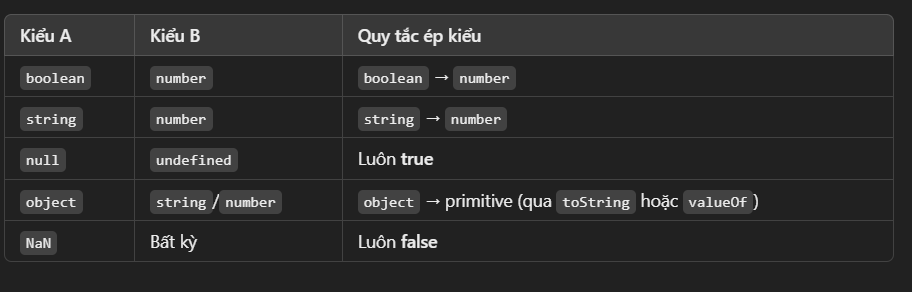

# Chuong 3: Toán tử so sánh, câu điều kiện, coercion

- Chuyển đổi sang Number với Number()
  - Chú ý: undefined và string sẽ chuyển sang NaN
  - Chuyển đổi từ boolean: true -> 1, false -> 0
  - Chuyển đổi từ null: 0
- Chuyển đổi sang String với String()
  - Chuyển đổi các kiểu dữ liệu khác (tên của nó) sang string
    - Chú ý: null và undefined sẽ chuyển sang "null" và "undefined"
    - Chuyển đổi từ boolean: true -> "true", false -> "false"
    - Chuyển đổi từ number: 123 -> "123"
    - Chuyển đổi từ object: {a: 1} -> "[object Object]"
    - Chuyển đổi từ array: [1, 2, 3] -> "1,2,3"
    - Chuyển đổi từ function: function(){} -> "function(){}"
    - Chuyển đổi từ symbol: Symbol() -> "Symbol()"
    - Chuyển đổi từ date: new Date() -> "Thu Jul 29 2021 15:00:00 GMT+0700 (Indochina Time)"
    - Chuyển đổi từ error: new Error() -> "Error"
- Chuyển đổi sang Boolean với Boolean()
  - Chuyển đổi từ string: "" -> false, "abc" -> true
  - Chuyển đổi từ number: 0 -> false, 123 -> true
  - Chuyển đổi từ object: {} -> true
  - Chuyển đổi từ array: [] -> true
  - Chuyển đổi từ function: function(){} -> true
  - Chuyển đổi từ symbol: Symbol() -> true
  - Chú ý: null, undefined, NaN -> false
  - Nói chung falsy(undefined, "", 0, NaN, null) value -> false, còn lại -> true
- Type coercion
  - \- \* \/ và \% sẽ chuyển đổi toán hạng sang number
  - \+ sẽ chuyển đổi toán hạng sang string
  - ép kiểu trong câu điều kiện
    - 0, "", null, undefined, NaN -> false
    - còn lại -> true
- Toán tử điều kiện, so sánh
  - > < >= <=
  - && || !
  - == : so sánh giá trị(loose equality)
  - 
  - === : so sánh giá trị và kiểu dữ liệu(strict equality)
- Câu lệnh điều kiện
  - if(condition) {statement}
  - switch(expression) {case value: statement; break; default: statement; break;}
- Ternary operator(toán tử 3 ngôi)
  - condition ? true : false
- Prompt, confirm, alert
  - prompt("message", "default value") -> trả về giá trị người dùng nhập
  - confirm("message") -> trả về true hoặc false
  - alert("message") -> hiển thị thông báo
-
