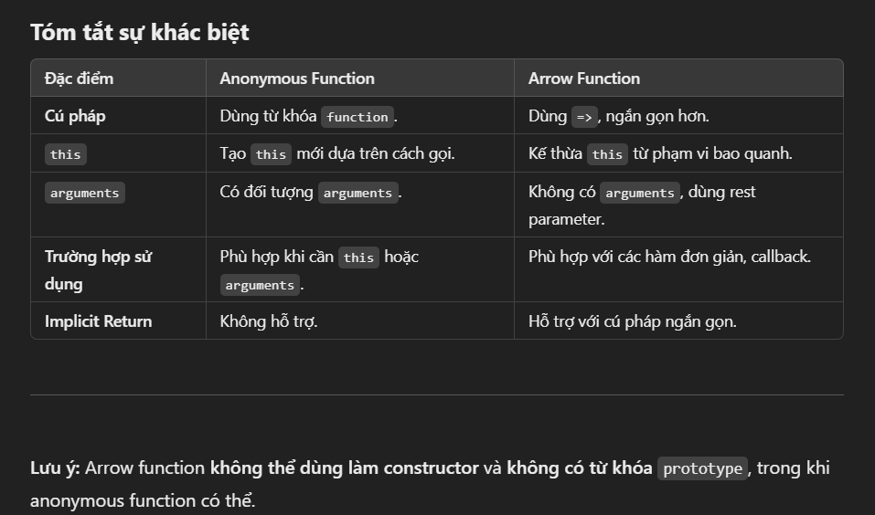

# Chuong 4: Hàm toàn tập

- functions
  - function functionName(params){
  - }
  - Không return trả về undefined
  - function có bị hoisting nên có thể gọi trước khi khai báo
  - giá trị mặc định phải truyền vào cuối cùng
  - Invoke function: sum(arguments) Đối số
- Gán function vào biến
  - const sum = function(a, b){
  - }
  - Hoặc định nghĩa function rồi gán lại
  - Ứng dụng trong con trỏ hàm
- Anonymous function
  - Không tên
  - const sum = function(a, b){
  - }
  - Thường dùng trong callback
  - Không bị hoisting
- IIFE (Immediately Invoked Function Expression)
  - (function(){
  - })()
  - Không bị hoisting
  - Thường dùng để tạo scope riêng
- Scope
  - Global scope
  - Function scope: {} của function
  - Block scope: {} của if, for, while
  - Chú ý var là function scope còn let, const là block scope
  - Vì var bị hoisting nên nó sẽ được khai báo global scope rồi vào trong block được gán giá trị nên có thể gọi bên ngoài block (chỉ áp dụng với block còn function thì không bị)
- Closure
  - Lexical Scope: Function con sẽ có thể truy xuất biến của function cha khi định nghĩa function con trong function cha
- Arrow function
  - const sum = (a, b) => { return a + b }
  - Implicit return: (params) => {}
  - 
